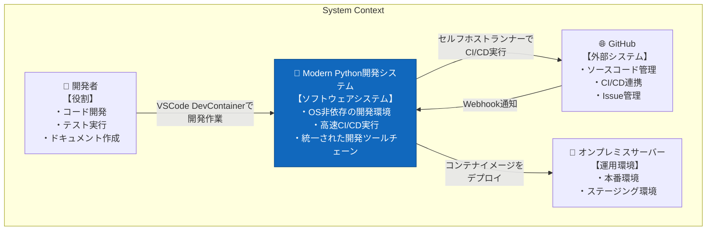
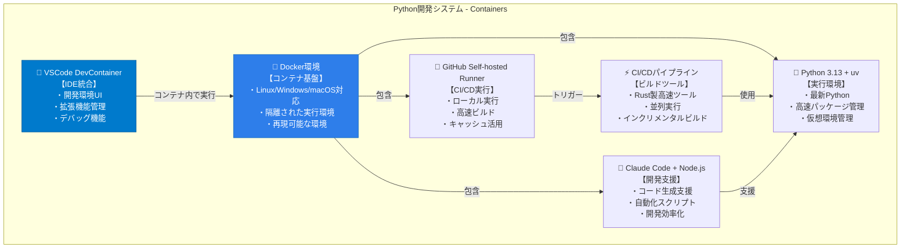
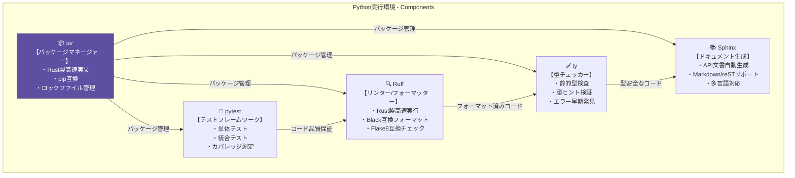

# Modern Python開発環境 C4アーキテクチャ図

## System Context図（レベル1）
システムの全体的な位置づけと外部アクターとの関係

## Container図（レベル2）
システム内のコンテナ（実行単位）とその関係

## Component図（レベル3）
Python実行環境内のコンポーネント詳細

## アーキテクチャの特徴

### 1. **OS非依存性**
- Docker Containerによる完全な環境分離
- Windows/macOS/Linux全てで同一の開発体験

### 2. **高速化**
- Rust製ツール（uv, Ruff）による高速実行
- GitHub Self-hosted Runnerによるローカルビルド
- キャッシュを活用した効率的なビルド

### 3. **開発効率**
- VSCode DevContainerによる即座の開発開始
- Claude Codeによる開発支援
- 統一されたツールチェーン

### 4. **品質保証**
- pytest による包括的なテスト
- Ruff による一貫したコードスタイル
- ty による型安全性の確保
- Sphinx による最新ドキュメントの維持

## 技術選定理由

| コンポーネント | 選定理由 |
|------------|---------|
| Python 3.13 | 最新の言語機能とパフォーマンス改善 |
| uv | pip/pip-tools/pipenvより高速、Rust実装 |
| Ruff | Black+Flake8+isortを統合、超高速 |
| pytest | デファクトスタンダード、豊富なプラグイン |
| ty | 軽量な型チェッカー |
| Sphinx | Python公式ドキュメントツール |
| Docker | 環境の再現性と隔離性 |
| GitHub Runner | CI/CDのローカル実行による高速化 |